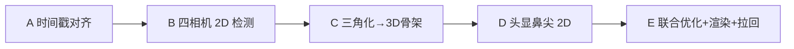

# 可复用 Pipeline：双外部双目 + 头显 + 动捕

本文件描述**可复用的准确流程**，不是某次数据集的开关表。新数据时用户在对话中粘贴路径；agent 运行时填入路径，**不要**为每个数据集改本文件。默认每套新数据跑完整流水线；不需要的段落由用户自行删掉。禁止远程跑算（本文件不授权启动远端 compute）。

执行顺序（名称与顺序一致）：




各昂贵阶段开始前：若该阶段产出已存在，且上游输入（尤其对齐时间戳 / manifest）有效，则**跳过该阶段直接下一步**，无需用户审核。

---

## 约定（物理 / 坐标 / 关节交付）

### 相机 ↔ 动捕刚体

以 config 中 `known_metadata_override.confirmed_mapping` 为准；**禁止**从 `aligned_30hz_report.json` 反推映射。


| 逻辑模块                     | Mocap 刚体   | 相机                | 备注                                     |
| ------------------------ | ---------- | ----------------- | -------------------------------------- |
| module01 (`external_01`) | **CH3-04** | CAM_A=左 / CAM_D=右 | MJPEG `left_CAM_A_`* / `right_CAM_D_*` |
| module02 (`external_02`) | **CH3-01** | CAM_A=左 / CAM_D=右 | 同上                                     |
| head                     | **CH3-08** | CAM_A=左 / CAM_D=右 | 源码流 `.h265`                            |


外部显示：`display_rotate_180: true`。推理在直立画面上跑，JSONL 坐标还原为原始 sensor 像素。

### 肢端 / 鼻尖 GT（刚体 tip）

公式（**刚体局部坐标**，非世界轴）：

```text
p_world = R_world_rigid @ [0, 0, z_offset_m] + t_world_rigid
```


| 锚点     | 刚体         | 局部偏移                            | 用途                                   |
| ------ | ---------- | ------------------------------- | ------------------------------------ |
| 左肢 tip | **CH3-06** | 腕：`[0,0,-60mm]`；踝：`[0,0,-80mm]` | 按数据集角色替换 `left_wrist` / `left_ankle` |
| 右肢 tip | **CH3-07** | 同上（同数据集左右同 z）                   | 替换 `right_wrist` / `right_ankle`     |
| 鼻尖 tip | **CH3-08** | `[0, -15, -125] mm`             | nose GT；外部骨架对齐 / 头显投影                |


门控：刚体 `status==1` 且 `raw_tick_valid==1`（`tick_valid` gate）。

### 外部相机坐标链

```text
T_world_CAM_A = T_world_CH3 @ T_mocap_rigid_rigid_k @ T_CH3_CAM_A(left, rigid-K 机械文件)
T_world_CAM_D = T_world_CAM_A × inverse(T_CAM_D_CAM_A)
```

- 使用 `external_stereo_rigid_k_extrinsics.json` 的 per-module A–D；**不用**四相机联合 Kalibr 链。
- `T_mocap_rigid_rigid_k`：CH3 相对 rigid-K 绕 Z 的离散轴修正（见 config `mocap_axis_note`）。
- Head：`head_camera_rotation_basis=xy_swap`；`T_mocap_rigid_head` = I；无 `mirror_y`（开 mirror_y 会左右手反）。


### 关节 / 关键点交付


| 类别    | 约定                                                                                             |
| ----- | ---------------------------------------------------------------------------------------------- |
| 面部    | **只保留鼻尖**（`nose`）；眼/耳不进入交付骨架 / 头显绘制                                                            |
| 足部    | **每脚只保留一个脚尖**（`left/right_big_toe` 或 alias `left/right_toe`）；默认不交付 small_toe / heel            |
| 踝关节   | **腕数据**：踝与脚尖均保留（多目三角化，不做 mocap 踝替换）。**踝数据**：踝由 mocap tip **替换**；脚尖仍三角化                         |
| 腕关节   | **腕数据**：腕由 mocap tip 写入。**踝数据**：无肢端腕刚体 GT 时保留三角化腕点                                             |
| 滤波    | 鼻尖、脚尖及其余保留关节均需时域滤波                                                                             |
| 骨长软约束 | 肩宽 / 大臂 / 小臂 / 大腿 / 小腿 / 脚长可作低权重目标（模板：`C:\Users\hand\Desktop\Dataset\骨骼测量记录模板.xlsx`），权重宜小，避免跳变 |


KEEP（禁止当中间结果删除）：各路源视频与 `timestamps.csv`、`aligned_data/`、`*.abx2`。可重建：`inference/`、`multiview_3d_results/`（manifest 可重建但依赖 aligned）、logs。

---


## Stage A — 时间戳对齐

目标：把外部双模组四路 MJPEG、头显双路、动捕刚体，统一到同一套 30 Hz 同步表，并生成下游可用的帧级 manifest。本阶段写的是**每次对齐必须执行的操作规范与硬约束**，不是背景阅读材料。

### A.1 必备输入


| 源              | 文件                                                            | 关键字段                                                                                     |
| -------------- | ------------------------------------------------------------- | ---------------------------------------------------------------------------------------- |
| 外部 module01/02 | `*.mjpeg` + `timestamps.csv`                                  | 按 `camera` 过滤后的 `frame_index`、`sequence`、`exposure_end_device_timestamp_us`、`jpeg_valid` |
| 头显             | **elementary** `module01_*_CAM_{A,D}.h265` + `timestamps.csv` | `camera`、`exposure_end_ts_ms`、`bytes`（逐包字节长度）                                            |
| 动捕             | 导出后进入对齐表的 CH3 位姿列                                             | `mocap_CH3_*_{x,y,z,qw,qx,qy,qz,status,...}`                                             |
| 产出             | `aligned_data/aligned_30hz.csv`（及 report）                     | 每行一个同步 `seq`；含各路 `*_exposure_end_timestamp_ms`、clock residual、刚体位姿                       |
| Manifest       | `multiview_3d_results/aligned_manifest.jsonl`                 | 由 `build_aligned_multiview_manifest.py` 从 aligned + 各路 timestamps **回查** `frame_index`   |


头显目录里可保留 remux `.mp4` 作备份，但**对齐、检测、渲染一律不得以 mp4 帧序当 capture index**。

### A.2 对齐方法（必须按此做）

1. **同步主轴用曝光结束时间**，不用「解码包序号」、不用「OpenCV 读到的第 N 帧」、不用 aligned 的 `seq` 当视频帧号。
2. **时钟域**：外部 module01 / module02 / 头显 / 动捕各自有设备时钟；对齐表写入 `external01_clock_residual_ms` / `external02_clock_residual_ms` 等残差。残差异常大时先修对齐，禁止带着错误残差进三角化。
3. **生成 / 校验** `aligned_30hz.csv`：每一行对应同一世界时刻的四路外部曝光结束时间 + 最近邻动捕帧 +（若流程含头）头显曝光时间。缺源、缺列、行数为空 → **停止**，不得进入 Stage B。
4. **生成** `aligned_manifest.jsonl`（脚本：`build_aligned_multiview_manifest.py`）：
  - 对 aligned 每一行，取 `external0{1|2}_CAM_{A|D}_exposure_end_timestamp_ms`，换算为 µs；
  - 在对应模组 `timestamps.csv` 中，**仅** `camera==该路` 且 `jpeg_valid==1` 的行里，按 `exposure_end_device_timestamp_us` 精确或容差匹配（容差见 config `quality.timestamp_match_tolerance_us`）；
  - 写入该路视频的真实 `frame_index` / `capture_sequence`，以及该帧 `T_world_camera`；
  - **禁止**把 aligned `seq` 直接当作 MJPEG/`VideoCapture` 帧号。
5. **头显侧索引**：按 `camera` 分组后，用 `exposure_end_ts_ms` ↔ aligned 中对应头显时间列匹配；解码时用同文件的 `bytes` 顺序喂 `H265CaptureReader` / PyAV，得到与 capture 行一致的图像。
6. **跳过条件**：若 `aligned_30hz.csv` 已存在且抽样校验曝光时间与各路 `timestamps.csv` 一致，且 `aligned_manifest.jsonl` 行数与 aligned 一致、四路 `frame_index` 均可回查，则本阶段可跳过，直接 Stage B。


### A.3 强制注意事项（历史白跑根因 → 每次必须遵守）

下列每条都曾导致「骨架比视频快/慢、整段白跑、或越往后错位越大」。对齐与一切读帧代码必须执行：

1. **头显禁止用 remux MP4 做同步解码**
  OpenCV 读 remux 后的 `.mp4` 时，**画面第 N 帧实际对应 capture N+4**（与 elementary `.h265` 逐帧 MAE=0 对照证实）。表现：人比骨架超前约 4 帧（观感常被说成骨架慢 5–10 帧）。  
   **强制**：头显一律 `*.h265` + `timestamps.csv` 的 `bytes` 包切分解码（`H265CaptureReader`）。Config 的 `video_glob` 必须指向 `.h265`。
2. **不得用「第 N 个可解码 H.265 包」当触发序号**
  坏包时 FFmpeg/容器层会藏帧或补帧，可解码包数 ≠ timestamp 行数 ≠ 触发数；旧流程约千帧级可漂到几十个触发周期。必须以 timestamp 行 + `bytes` 与 capture index 绑定。
3. `timestamps.csv` **必须先按 camera 分组再编号**
  文件内 CAM_A/CAM_D 行交错。使用全局 CSV 行号会错路、错帧。外部索引还须过滤 `jpeg_valid!=1`。
4. **外部 MJPEG 禁止依赖** `CAP_PROP_POS_FRAMES` **随机 seek**
  对本批 MJPEG，OpenCV seek(N) 常读回第 0 帧；跳变帧上触发 seek 会使错位**随时间累积**，观感为「骨架越来越快」。  
   **强制**：顺序 `read`，或重开后顺序跳过到目标 `frame_index`；推理与渲染同一套绝对帧号来自 manifest。
5. **单位与列名**
  aligned 多为 `*_exposure_end_timestamp_ms`；外部 timestamps 为 `exposure_end_device_timestamp_us`；头显为 `exposure_end_ts_ms`。换算错误（×1000 漏乘/多乘）会整表错匹配。manifest 匹配失败率高 → 停，查单位与列名，禁止放宽容差硬过。
6. **刚体映射与对齐表解耦**
  module01↔CH3-04、module02↔CH3-01、head↔CH3-08 以物理确认与 config 为准。对齐 report 里的命名/MXID 推断曾与实物不一致，**不得**用 report 改映射后重跑几何。
7. **KEEP**
  `aligned_data/` 与各路 timestamps 是同步源，清理中间结果时禁止删除。无 aligned 则必须先完成对齐再推理/三角化。
8. **验收抽样（对齐完成后必做）**
  - 抽开头 / 中间 / 末尾若干 `seq`：四路外部画面动作相位一致；  
  - manifest 中 `timestamp_match_error_us` 应为 0 或远小于容差；  
  - 头显：用 `.h265`+`bytes` 解出的帧与 aligned 头时间一致；若误用 mp4，会出现固定约 +4 帧超前。

失败即停止：缺 aligned / 时间戳对不齐 / manifest 大量 fallback / 误用 mp4 帧序。不得带着错误同步进入检测。

---


## Stage B — 四相机 2D 检测

对 module01/02 × CAM_A/D 四路外部 MJPEG 跑 RTMW WholeBody（含足部），产出候选 JSONL。

**跳过条件**：四路 `inference/module##_CAM_*.jsonl` 已存在且含鼻尖与左右脚尖字段，且 Stage A 的 aligned / manifest 已校验通过 → 跳过，直接 Stage C。无需审核。

**并行（必须拉满）**：双 GPU 多进程。建议 module01 → GPU0、module02 → GPU1，两路相机可再并行；`--mode performance --device cuda --backend onnxruntime --rotate-180`。


| 项    | 内容                                                        |
| ---- | --------------------------------------------------------- |
| 输入   | 四路 MJPEG；帧号以 manifest / 顺序解码为准；`display_rotate_180`       |
| 脚本   | `infer_rtmpose_candidates.py`                             |
| 输出   | `inference/module01_CAM_A.jsonl` … `module02_CAM_D.jsonl` |
| 交付裁剪 | 2D/下游：**面部只留鼻尖**；**每脚一个脚尖**                               |
| 滤波   | 对鼻尖、脚尖及保留关节防抖（2D 后和/或 3D 后）                               |
| 失败   | GPU OOM、body-only 旧缓存、缺视频 → 备份旧 jsonl 后重推；改关键点集合后须重跑 C/E  |


---


## Stage C — 多相机三角化 → 3D 骨架

由 aligned manifest + 四路 2D 候选，恢复 mocap world 下的多视角骨架。

**跳过条件**：`full/multiview_3d_results.jsonl`（或等价 full 产物）已存在且与当前 manifest / 2D 输入一致 → 可跳过。改检测或对齐后必须重跑。

**并行（必须拉满）**：分 chunk 多进程（默认 **8** chunk），吃满 CPU；双机/双卡环境与检测阶段错开资源时优先占满。合并：`merge_multiview_chunks.py --context-frames 10`。


| 项   | 内容                                                                   |
| --- | -------------------------------------------------------------------- |
| 输入  | `aligned_manifest.jsonl` + `inference/*.jsonl` + 数据集 config          |
| 脚本  | `process_external_multiview_3d.py`；`merge_multiview_chunks.py`       |
| 输出  | `full/multiview_3d_results.jsonl`；含 module01 双目 / module02 双目 / 四目联合 |
| 质量  | 跟 config `quality.*`（置信度、射线角、重投影等）                                   |
| 失败  | chunk 缺文件、条件数爆炸、跨模块中心门控失败 → 查外参映射与 2D 置信度；**勿用 report 改刚体映射**        |


本阶段动捕只提供相机刚体位姿，**尚未**写入肢端关节 GT，也尚未做联合优化。

---


## Stage D — 头显鼻尖 2D 检测

在头显 CAM_A / CAM_D 上检测 face nose tip，作为 Stage E 联合优化的观测。

**跳过条件**：`head_reprojection/nose_offset_opt/head_CAM_*_rtmw_nose.csv`（或当前约定路径）已存在且由 `.h265` 路径产出 → 可跳过。

**并行**：双卡可对 CAM_A / CAM_D 并行。


| 项   | 内容                                                                                         |
| --- | ------------------------------------------------------------------------------------------ |
| 输入  | `data_root/<head_id>/module01_*_CAM_{A,D}.h265` + `timestamps.csv`（**禁止**用 remux mp4 当同步源） |
| 脚本  | `detect_head_nose_rtmw.py --camera CAM_A                                                   |
| 约定  | 只使用 face nose tip                                                                          |
| 失败  | 缺 h265、时间戳对不齐、分数过低 → 不进入 Stage E                                                           |


顺序：本阶段在三角化之后、联合优化之前；鼻尖 2D 是联合优化观测之一。

---


## Stage E — 刚体 GT + 联合约束优化 + 头投影渲染 + 拉回

将原「肢端 GT / 世界系 nose」与「头显鼻偏置优化 / 渲染」合并为**同一套联合优化**，避免两套大平移互相打架。然后渲染验收并拉回本地。

**实现（2026-08-07）**：`replace_limb_mocap_gt.py --mode per_frame`（逐帧 nose + 肢端硬替换）+ `optimize_multiview_head_nose_offset.py --mode per_frame`（头显 2D 小幅 rigid refine）+ 并行渲染；delivery 关键点见 `delivery_keypoints.py`。

### E.0 强制禁止：踝刚体 → 膝/脚尖方向约束

**禁止**用踝动捕刚体（CH3-06/07）的局部坐标轴推「足向」，再把三角化脚尖 / 膝往该方向拉。

原因：**踝刚体坐标系和骨架关节坐标系没对齐**；用 `R_ankle @ foot_dir` 造脚尖目标会系统性歪脚。

允许：

- 踝 tip 硬替换（刚体局部 `[0,0,z]`，踝集 z=−80mm）；
- 脚尖保留多目三角化；
- 可选低权重骨长（脚长）软约束，**不得**依赖踝刚体朝向。

代码 / report 须显式标记 `ankle_rigid_to_toe_constraint: false`。

### E.1 批注意图

1. **腕** tip = `R @ [0,0,-60mm] + t`；**踝** tip = `R @ [0,0,-80mm] + t`（左右同数据集同 z）。
2. **Nose**：每一帧调整贴合 GT 鼻尖（替代全序列固定 world offset）。
3. 有腕/踝肢端 GT 时，用 **nose + 刚体同时约束**（不只 only-nose）。
4. 自由度不限于刚体 SE(3)：骨长可低权重参与（测量模板 xlsx）。
5. **腕 vs 踝交付**：腕数据保留三角化踝 + 脚尖；踝数据替换踝 GT，脚尖仍三角化。
6. Stage D 头显 2D 鼻尖并入同一优化问题再渲染；不要先做大 world 平移再做另一套大 rigid 平移。
7. 渲染读头显帧必须走 `.h265`+`bytes`（见 Stage A.3）；并行拉满（默认 **24** render chunks，`--prepare` / per-chunk / `--merge`）。
8. **每次完整跑必出视频**（见 E.3）。

### E.2 推荐联合优化流程

```text
每帧（tick_valid 的鼻与左/右肢 tip 可用时；头显鼻 2D 按时间对齐可用时）：
  1) 构造 GT / 观测锚点
       nose_gt  = T_CH3_08 @ [0,-15,-125]mm
       L_gt     = T_CH3_06 @ [0,0,z]     # z=-60mm(腕) 或 -80mm(踝)
       R_gt     = T_CH3_07 @ [0,0,z]
       nose_2d  = Stage D 头显 CAM_A/D 检测（按帧对齐）
  2) 硬约束 / 高权重：按数据集角色写入 GT
       腕集：left_wrist, right_wrist ← L_gt, R_gt；踝/脚尖保留三角化
       踝集：left_ankle, right_ankle ← L_gt, R_gt；脚尖保留三角化
  3) 逐帧调整使 nose_ext → nose_gt
  4) 分层软约束（可选 / 消融）：
       · Nose 主导 → 双肩（肩宽/肩中点相对鼻）
       · 腕刚体   → 腕、肘与上臂/前臂骨长
       · 踝刚体   → 仅踝 tip 硬替换；膝可用骨长软约束
       · 【禁止】用踝刚体朝向拉脚尖 / 膝（见 E.0）
  5) 骨长软约束（低权重，可选）：肩宽/大臂/小臂/大腿/小腿/脚长
  6) 头显观测：骨架投到头相机，用 nose_2d 小幅 refine（同一优化问题）
  7) 时域滤波 → delivery playback → 并行渲染 → 拉回本地
```


| 项   | 内容                                                                                                                                     |
| --- | -------------------------------------------------------------------------------------------------------------------------------------- |
| 输入  | Stage C 骨架 jsonl；mocap；Stage D head nose csv；config                                                                                    |
| 脚本  | `replace_limb_mocap_gt.py`；`optimize_multiview_head_nose_offset.py`；`export_playback_from_jsonl.py`；`render_*`；`run_0806_limb_dataset.sh` |
| 输出  | pre_limb / limb_gt jsonl；`skeleton_playback_raw.json` / `skeleton_playback.json`；E.3 所列 mp4；nose_offset_opt report                      |
| 验收  | 头显鼻尖贴合；肢端 GT 侧腕/踝稳定；脚尖为三角化而非刚体推方向；骨长约束未引入整段抖动；踝 tip z=−80 / 腕 z=−60                                                                     |
| 失败处理 | 单侧 `raw_tick_valid` 掉线 → 该帧跳过或只替换有效侧；z 以腕 −60 / 踝 −80 为准；骨长权重过大导致抖动 → 降权或暂关；投影左右反 → 查 xy_swap、确认未开 mirror_y                            |


### E.3 每次完整跑必出的 MP4 / 可视化

路径相对 `data_root/multiview_3d_results/full/`：


| #   | 产物                                                                  | 说明                                                                                         |
| --- | ------------------------------------------------------------------- | ------------------------------------------------------------------------------------------ |
| 1   | `visualization/external_4cam_2d_skeletons.mp4`                       | 四路外部相机 **用于三角化的 2D 骨架**（观测）合成为一路 2×2；由 `render_external_multiview_results.py` 产出后复制/改名 |
| 2   | `visualization/skeleton_3d_raw_yaw.mp4`                              | **原始三角化** 3D 骨架回放（与「0806 dual-external 3D skeleton」同关键点约定：面部仅鼻、每脚一 tip；yaw 固定视角 MP4）     |
| 3a  | `head_reprojection/nose_offset_opt/head_CAM_A_direct_noseonly.mp4`  | 原始三角化 3D → 头显 CAM_A 投影                                                                      |
| 3b  | `head_reprojection/nose_offset_opt/head_CAM_D_direct_noseonly.mp4`  | 原始三角化 3D → 头显 CAM_D 投影                                                                      |
| 4   | `head_reprojection/nose_offset_opt/head_2x2_direct_vs_nose_offset_opt.mp4` | 联合优化后对比：**2×2**（上：A before/after；下：D before/after；既有 nose_offset_opt 风格）              |


辅助：`skeleton_playback_raw.json` / `skeleton_playback.json`（delivery v2，含 edges / frame_count）；可选 `skeleton_3d_optimized_yaw.mp4`。

拉回：优先最终 jsonl、playback、visualization/*.mp4、nose_offset_opt 下 mp4/report；确认未误拉空目录或旧 body-only 结果。

---


## 脚本与配置索引


| 角色               | 路径                                                                            |
| ---------------- | ----------------------------------------------------------------------------- |
| Manifest         | `data_processing/scripts/joint_projection/build_aligned_multiview_manifest.py`              |
| 四相机 2D           | `data_processing/scripts/joint_projection/infer_rtmpose_candidates.py`                      |
| 三角化              | `data_processing/scripts/joint_projection/process_external_multiview_3d.py`                 |
| 合并               | `data_processing/scripts/joint_projection/merge_multiview_chunks.py`                        |
| 肢端 GT            | `data_processing/scripts/joint_projection/replace_limb_mocap_gt.py`                         |
| 头鼻 2D            | `data_processing/scripts/joint_projection/detect_head_nose_rtmw.py`                         |
| 鼻偏置优化            | `data_processing/scripts/joint_projection/optimize_multiview_head_nose_offset.py`           |
| 并行重投影渲染          | `data_processing/scripts/joint_projection/render_nose_offset_parallel.py`                   |
| 头显解码（h265+bytes） | `data_processing/scripts/joint_projection/render_multiview_to_head.py`（`H265CaptureReader`） |
| 外部刚体外参           | `data_processing/scripts/joint_projection/external_stereo_rigid_k_extrinsics.json`          |
| 头显刚体外参           | `data_processing/scripts/joint_projection/head_stereo_rigid_extrinsics.json`                |
| 腕 config         | `data_processing/scripts/joint_projection/configs/0806_wrist_dual_external_mocap.json`      |
| 踝 config         | `data_processing/scripts/joint_projection/configs/0806_ankle_dual_external_mocap.json`      |
| 骨长测量模板           | `C:\Users\hand\Desktop\Dataset\骨骼测量记录模板.xlsx`                                 |
| 四相机说明（背景）        | `data_processing/scripts/joint_projection/0806_双外部双目四相机三角化说明.md`                            |
| 本地总控（参考）         | `data_processing/scripts/joint_projection/overnight_0806_limb_batch.py`                     |
| 远端一键（参考，默认不启）    | `data_processing/scripts/joint_projection/run_0806_limb_dataset.sh`                         |
| Delivery 关键点        | `data_processing/scripts/joint_projection/delivery_keypoints.py`                            |
| Raw playback 导出     | `data_processing/scripts/joint_projection/export_playback_from_jsonl.py`                    |
| 3D yaw MP4           | `data_processing/scripts/joint_projection/render_skeleton_yaw_video.py`                     |


---


## 消融实验 Plan

> **先不跑，用户之后再跑。** 本节只作调试联合优化方法的实验设计；默认生产流水线用 E.2 的 v1（per-frame nose + 肢端硬替换 + 头显 2D 小幅 refine；**不开**踝刚体→脚尖）。

### 目标

在腕 / 踝各一套已对齐数据上，隔离各约束项对头显鼻尖贴合、肢端稳定、脚尖合理性、时域抖动的贡献。

### 公共基线（所有消融共享）

- 同一 `aligned_30hz.csv` / manifest / Stage B 2D / Stage C 三角化 `*_pre_limb.jsonl`
- tip 公式与 z：腕 −60mm、踝 −80mm；`tick_valid` gate；面部 nose-only；每脚一 tip
- 头显始终 `.h265`+`bytes`；对比视频同一套 2×2 模板
- **全集禁止**「踝刚体朝向拉脚尖」变体（该方向已否决，不做消融）

### 因子表（v1）


| ID    | 因子              | Off / A                                              | On / B                                                         | 主要观察          |
| ----- | --------------- | ---------------------------------------------------- | -------------------------------------------------------------- | ------------- |
| A1    | Nose 对齐时间结构      | `replace --mode fixed` 全序列一个 world offset            | `replace --mode per_frame` 逐帧 nose→GT                          | 头/躯干漂移 vs 抖动  |
| A2    | 肢端 GT            | 只做 nose，不 replace 腕/踝 tip                             | nose + CH3-06/07 tip 硬替换                                       | 肢端贴合、连带肘膝     |
| A3    | 头显 2D Layer2     | 仅 Layer1（3D nose GT）                                  | Layer1 + RTMW 2D refine                                        | 头显投影鼻尖误差      |
| A4    | 骨长软约束           | 关                                                   | 低权重：肩宽/大臂/小臂/大腿/小腿/脚长（模板 xlsx）                                  | 骨长合理 vs 整段抽动  |
| A5    | 肩部相对鼻软约束        | `--soft-shoulder-weight 0`                           | 非零小权重                                                          | 双肩相对鼻稳定性      |
| A6    | 膝约束（踝集）         | 无膝项                                                  | 仅骨长/折角软约束（**仍禁止**刚体足向）                                           | 膝跳变、小腿长       |
| A7    | 踝 tip z（踝集）     | −60mm（错误旧默认）                                         | −80mm（计划）                                                      | 踝高度/与脚尖相对     |
| A8    | 腕 tip z（腕集）     | −80mm（对照）                                            | −60mm（计划）                                                      | 腕高度           |
| A9    | 时域滤波强度          | sigma=0                                              | sigma≈1（默认） / 更大                                               | 抖 vs 滞后       |
| A10   | Delivery 脚尖来源   | 保留 small_toe/heel 进 playback（对照旧）                     | 仅 big_toe（计划）                                                  | 可视化干净度        |


### 建议跑法（用户启动时）

1. **最小矩阵（优先）**：腕、踝各跑  
   - Baseline = 当前生产（A1=B, A2=On, A3=On, A4=Off, A5=Off, A7/A8=计划 z）  
   - −A1 fixed nose  
   - −A2 no limb GT  
   - −A3 no head 2D  
   - +A4 bone-length soft（低权）  
2. **踝集加跑**：A7 −60 vs −80；A6 膝软约束 on/off  
3. **指标（离线算，不改渲染）**  
   - 头显 nose 重投影 median/p90 px（A/D）  
   - 肢端 tip ↔ GT mm（tick_valid 帧）  
   - 脚尖相对踝的骨长方差；序列加速度抖动  
   - 主观：2×2 头显 + `skeleton_3d_*_yaw.mp4`  
4. **输出目录建议**：`full/ablation/<ID>_<tag>/`，互不覆盖生产 `nose_offset_opt/`  
5. **入口**：复用 `replace_limb_mocap_gt.py` / `optimize_multiview_head_nose_offset.py` 的 `--mode` 与权重开关；需要时再加 CLI，**不要**改生产默认。

### 明确不做

- 用踝刚体 R 推脚尖 / 足向的任何 ablation cell  
- 头显 remux mp4 帧序对照（已否决）  
- 未对齐数据上的消融

---


## TODO（可选，用户可打字）

已对齐（相对本计划，2026-08-07）：

- Delivery 关键点：`delivery_keypoints.py`（nose-only + 每脚 big_toe）；playback schema v2。
- `replace_*`：`--mode per_frame`（默认）；腕/踝分支；踝 z 默认 −80；禁止踝刚体→脚尖。
- `optimize_*`：`--mode per_frame`；头显 2D refine；报告标记约束禁令。
- 入口 `run_0806_limb_dataset.sh`：**A→B→C→D→E**；踝 z=−80；产出 E.3 全部必出视频。
- 消融：见上节 — **先不跑**。

仍可增强（非阻塞）：

- 骨长软约束 / 肩软约束默认仍关闭，待消融确认权重再进生产默认。
- `infer_rtmpose_candidates.py` 仍写出 whole-foot 字段；交付阶段裁剪即可。

```
（用户备注）
```

